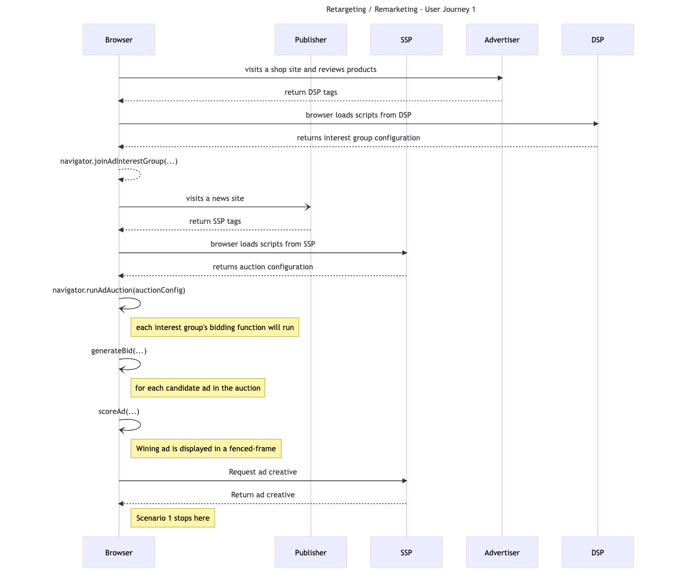

import Tabs from '@theme/Tabs';
import TabItem from '@theme/TabItem';

# Use Case : Retargeting / Remarketing

<Tabs>
  <TabItem value="overview" label="Overview" default>

## Overview

### Description

Remarketing is a type of online advertising that allows you to show ads to people who have already visited your website. You can create custom audiences based on different criteria, such as pages visited or products added to the cart. Remarketing can help you increase brand awareness, drive traffic back to your website, and boost sales.

### Privacy Sandbox APIs

- Protected Audience API

### Web ecosystem parties

- Publisher
- SSP
- Advertiser
- DSP

</TabItem><TabItem value="scope" label="Scope">

## Scope

### Goals

In this demo, we assume an advertiser would like to drive traffic back to their website. Remarketing can help an advertiser to get people who have already visited their website to come back for more or to complete a purchase. This can be done by showing them ads about the product they have previously looked at, on other websites.

### Assumptions

This use case assumes the advertiser (shop site) can bid on the publisher (news site) inventory through an agreement between their respective DSP and SSP platforms.

### Key Exclusions

The demo does not integrate existing auction mechanisms (prebid or header bidding…). it is only scoped to on-device auction with Protected Audience API.
The ad selection is very straightforward (only 1 bidder).
The bidding logic does not include real-time signals from Key/Value service.

### System Design

Using Protected Audience API, the user visits a shopping site, got added to an interest group. Later the same user visits a news site. There the browser runs an on-device Auction, bidding logic will select the winning interest group, and relevant ads will be dynamically rendered on the publisher page.

#### Protected Audience Flow

Below is a general introduction of Remarketing using Privacy Sandbox Protected Audience API. For further information see [Protected Audience API - Chrome Developers](https://developer.chrome.com/docs/privacy-sandbox/fledge/).


#### User Journey #1




</TabItem><TabItem value="demo" label="Demo">

## Demo

### Prerequisites

- Chrome > v107
- Enable Privacy Sandbox APIs
- Clear your browsing history before you run one of the demo scenario below

### User Journey #1

1. [Navigate to shop site](https://privacy-sandcastle-shop.dev/) (advertiser)
2. Click on a “shoe” product item on the shop site.
   - The shop (advertiser) would assume the user is interested in this type of product, so they would leverage Protected Audience API and ask the browser to join an ad interest group for this product or this specific product category.
3. [Navigate to the news site](https://privacy-sandcastle-news.dev/) (publisher)
4. Observe the ad served on the news site
   - If you previously browsed the “shoe” product on the shop site, you will be shown an ad for the same product.
   - When the page was loaded, Protected Audience API allowed the SSP to run an ad auction on the publisher site.
   - The winning advertiser of this ad auction gets their ad creative to be displayed on the publisher site. In this case you have cleared the browser history and only browsed 1 advertiser site page so you are only seeing 1 ad creative from the same advertiser.

### Implementation details

#### In (2) How is the user added to an Interest Group based on his browsing behavior ?

The shop product page [includes dsp-tag.js ](https://github.com/JackJey/privacy-sandcastle/blob/1d55a6d540b3b1949a36337dfe5e5221454d311b/services/shop/app/items/%5Bid%5D/page.tsx#LL58C13-L58C13)from the DSP service. This is a third-party tag from the DSP service.

```html
<script
  src="https://privacy-sandcastle-prod-dsp.web.app/dsp-tag.js"
  class="dsp_tag"
  data-advertiser="privacy-sandcastle-prod-shop.web.app"
  data-id="1f45e"
  data-nscript="afterInteractive"
></script>
```

This [dsp-tags.js](https://github.com/JackJey/privacy-sandcastle/blob/main/services/dsp/src/public/dsp-tag.js) dynamically embeds an iframe

```html
<iframe
  width="1"
  height="1"
  src="https://privacy-sandcastle-prod-dsp.web.app/join-ad-interest-group.html?advertiser=privacy-sandcastle-prod-shop.web.app&amp;id=1f45e"
  allow="join-ad-interest-group"
></iframe>
```

The iframe calls a third-party script [join-ad-interest-group.js](https://github.com/JackJey/privacy-sandcastle/blob/main/services/dsp/src/public/js/join-ad-interest-group.js) to join interest group using Protected Audience API

```javascript title="https://github.com/JackJey/privacy-sandcastle/blob/main/services/dsp/src/public/js/join-ad-interest-group.js"
// Protected Audience
async function getInterestGroup(advertiser, id) {
  const url = new URL(location.origin)
  url.pathname = "/interest-group.json"
  url.searchParams.append("id", id)
  url.searchParams.append("advertiser", advertiser)
  const res = await fetch(url)
  return res.json()
}

document.addEventListener("DOMContentLoaded", async (e) => {
  // Protected Audience
  const url = new URL(location.href)
  const advertiser = url.searchParams.get("advertiser")
  const id = url.searchParams.get("id")

  const interestGroup = await getInterestGroup(advertiser, id)
  console.log({ interestGroup })

  const kSecsPerDay = 3600 * 24 * 30
  console.log(await navigator.joinAdInterestGroup(interestGroup, kSecsPerDay))

  // Call Topics API for opt-in
  const topics = await document.browsingTopics?.()
  console.log({ topics })
})
```

This code sets up the interest groups options. Those options are fetched dynamically from [interest-group.json](https://github.com/JackJey/privacy-sandcastle/blob/1d55a6d540b3b1949a36337dfe5e5221454d311b/services/dsp/src/index.ts#L50).
Finally the code requests the browser to [join the interest group](https://github.com/JackJey/privacy-sandcastle/blob/1d55a6d540b3b1949a36337dfe5e5221454d311b/services/dsp/src/public/js/join-ad-interest-group.js#L37)

#### In (4) how do we serve an ad relevant to the user’s interest ?

The news page [includes ad-tag.js ](https://github.com/JackJey/privacy-sandcastle/blob/1d55a6d540b3b1949a36337dfe5e5221454d311b/services/news/src/views/index.ejs#L29)from the SSP service. This is a third-party tag from the SSP service.

```html
<script defer="" class="ssp_tag" src="https://privacy-sandcastle-prod-ssp.web.app:443/ad-tag.js"></script>
```

This [ssp-tags.js](https://github.com/JackJey/privacy-sandcastle/blob/main/services/ssp/src/public/ad-tag.js) dynamically embeds an iframe.

```html
<iframe
  width="300"
  height="250"
  src="https://privacy-sandcastle-prod-ssp.web.app/ad-tag.html"
  scrolling="no"
  style="border: none"
  allow="attribution-reporting; run-ad-auction"
></iframe>
```

The iframe calls a third-party script [run-ad-auction.js](https://github.com/JackJey/privacy-sandcastle/blob/main/services/ssp/src/public/js/run-ad-auction.js) to run an ondevice ad auction using Protected Audience API

```javascript title=”https://github.com/JackJey/privacy-sandcastle/blob/main/services/ssp/src/public/js/run-ad-auction.js”
// ssp
async function getAuctionConfig() {
  const url = new URL(location.origin)
  url.pathname = "/auction-config.json"
  const res = await fetch(url)
  return res.json()
}

document.addEventListener("DOMContentLoaded", async (e) => {
  // TODO: Call Topics API for select ads
  const topics = await document.browsingTopics?.()
  console.log({
    topics
  })

  const auctionConfig = await getAuctionConfig()

  const adAuctionResult = await navigator.runAdAuction(auctionConfig)

  console.log({
    auctionConfig,
    adAuctionResult
  })

  const $fencedframe = document.createElement("fencedframe")
  $fencedframe.src = adAuctionResult
  $fencedframe.setAttribute("mode", "opaque-ads")
  $fencedframe.setAttribute("scrolling", "no")
  // $fencedframe.setAttribute("allow", "attribution-reporting; run-ad-auction")
  $fencedframe.width = 300
  $fencedframe.height = 250

  console.log(`display ads in ${$fencedframe}`)

  document.body.appendChild($fencedframe)
})
```

The `runAdAuction` code is executed by the browser and will decide which ad will be served to the user.
The result of the auction is displayed within a Fenced Frame by specifying the urn to the ad creative. Developers would traditionally use https urls however Protected Audience API is hiding the creative url from the parent page by using a unique urn that is only recognized by the browser and mapped to a real url where the creative is fetched. This is a privacy protected mechanism to not reveal the user's interest to the parent page and the ssp.

```html
<body>
  <fencedframe src="urn:uuid:f20265ee-fcd4-4e79-8e70-61756b6c0ea9" mode="opaque-ads" scrolling="no" width="300" height="250"></fencedframe>
</body>
```

note that Fenced Frame attribute `mode` must be set to “opaque-ads” to display ads using urn.
Fenced Frame size (width and height) only allow pre-defined values, please refer to the allow-list from the documentation.
The request to the `src` urn[ returns the ad creative](https://github.com/JackJey/privacy-sandcastle/blob/1d55a6d540b3b1949a36337dfe5e5221454d311b/services/ssp/src/index.js#LL87C1-L87C1) to be displayed

```html
<html lang="en">
  <head>
    <meta charset="UTF-8" />
    <meta name="viewport" content="width=device-width, initial-scale=1.0" />
    <title>Your special ads from privacy-sandcastle-prod-shop.web.app</title>
    <link rel="icon" href="" />
  </head>

  <body>
    <a
      width="300"
      height="250"
      target="_blank"
      attributionsrc=""
      href="https://privacy-sandcastle-prod-ssp.web.app/move?advertiser=privacy-sandcastle-prod-shop.web.app&amp;id=1f45e"
    >
      <!-- smaller for avoid scrollbar -->
      
    </a>
  </body>
</html>
```

This code contains the `img` tag with `src` attribute specifying the product the user might be interested in and a link to the product.

### Related API documentation

- [Protected Audience API - Chrome Developers](https://developer.chrome.com/docs/privacy-sandbox/fledge/)
- [Protected Audience API: developer guide](https://developer.chrome.com/docs/privacy-sandbox/fledge-api/)

</TabItem></Tabs>
